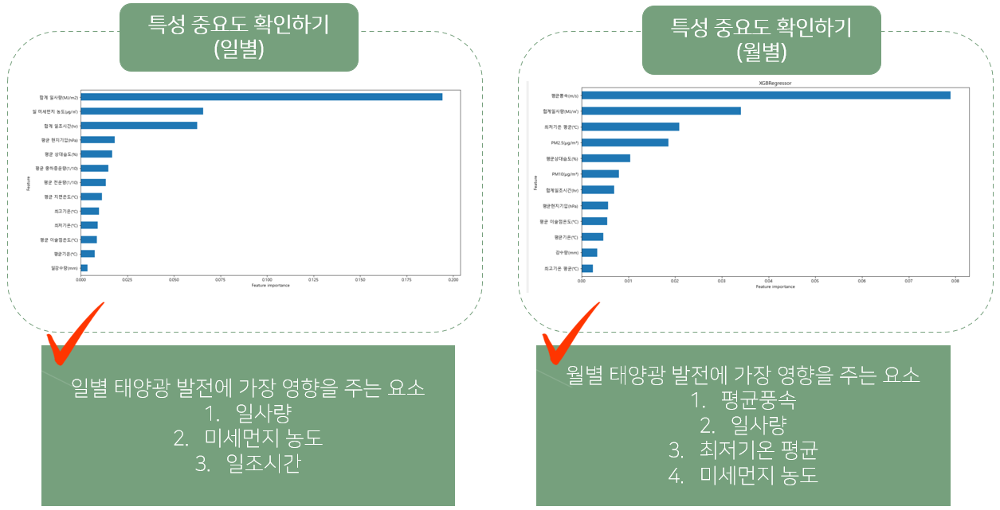

# 에너지 관련주 프로젝트 (2021년도 작업물)

이 프로젝트는 한국의 태양광 발전 현황과 관련 데이터를 분석하여 태양광 발전소의 발전량 예측 및 최적 입지 선정을 지원하기 위해 진행되었습니다.  
정부의 탈원전, 그린 뉴딜 등 친환경 에너지 정책과 맞물려, 태양광 발전에 대한 관심이 높아지고 있는 현 시점에서, 정보의 부재로 인해 사업 진입이 어려운 상황을 개선하고자 합니다.

---

## 목차

1. [태양광 발전 현황](#태양광-발전-현황)
2. [프로젝트 소개](#프로젝트-소개)
3. [데이터 분석 과정](#데이터-분석-과정)
4. [최적 지역 선정](#최적-지역-선정)
5. [활용 방안](#활용-방안)
6. [참고 자료](#참고-자료)

---

## 태양광 발전 현황

- **신재생 에너지 중요도 상승:**  
  - 정부의 저탄소, 친환경 정책 및 탈원전 정책과 맞물려 태양광 발전 설비 지원이 확대되고 있습니다.
  - 친환경 에너지의 세계적 트렌드에 따라 태양광 발전 비중이 증가하고 있습니다.

- **태양광 발전 현황:**  
  - 신재생 에너지 중 태양광이 차지하는 비율이 가장 높은 상태입니다.

>   
> *태양광 발전 설비 예시 (이미지 출처: 적절한 이미지 파일을 참조하세요)*

---

## 프로젝트 소개

### 프로젝트 명
**에너지 관련주를 샀읍니다 … 그렇게 됬읍니다 …**

### 프로젝트 목적
한국의 태양광 발전 산업은 아직 자리잡아가는 단계입니다.  
정보의 부족으로 태양광 발전 사업에 도전하고자 하는 사람들이 제대로 된 데이터를 활용하지 못하는 문제를 해결하기 위해,  
발전소 및 기상 데이터를 기반으로 발전량 예측 및 효율적인 입지 선정을 지원하는 프로젝트를 진행합니다.

### SWOT 분석

| Strengths (강점)                            | Weaknesses (약점)                  |
|---------------------------------------------|-----------------------------------|
| 환경친화적, 유지 비용이 거의 들지 않음       | 날씨 변화에 따른 발전량 변동성     |
| 소규모 설치 가능 (개인용)                    | 초기 설치 비용 부담                |

| Opportunities (기회)                        | Threats (위협)                      |
|---------------------------------------------|-------------------------------------|
| 친환경 정책 강화, 국가 지원 확대            | 태양광 발전 관련 정보 부족            |
| 탄소배출권 확보 가능                         | 국가 지원의 실효성에 대한 의문        |

### 타사 제품 분석

| 제품    | 제조사      | 특장점                                            | 한계점                             |
|---------|-------------|---------------------------------------------------|------------------------------------|
| 해줌    | 이든스토리  | 주소 입력만으로 발전량 및 수익성 검토, 지도 서비스 제공 | 기상데이터 활용 미흡               |

---

## 데이터 분석 과정

### 데이터 수집 및 전처리

1. **데이터 수집**  
   - **출처:** 국가통계 포털, 기상청, 전력거래소 등  
   - **주요 변수:** 지점, 일시, 평균기온, 최저/최고 기온, 강수량, 일조시간, 일사량, 미세먼지, 발전량 등

2. **데이터 전처리**  
   - **결측치 처리:**  
     - 월별 데이터가 없는 경우 일별 데이터를 병합하여 사용  
     - 미세먼지, 합계일조시간, 평균일사량 등 결측치는 일정 기간별 평균값으로 대체  
     - 전운량, 중하층운량, 강수량 등은 결측치를 0으로 치환
   - **특성 추가:**  
     - 예: 일사량과 일조시간을 결합하여 'sunlight_intensity' 특성 추가

3. **모델 학습 및 예측**  
   - **예측 모델:** RandomForestRegressor, XGBRegressor, BayesianRidge, Ridge, LinearRegression  
   - **단계:**  
     1. 데이터 분할  
     2. 모델 학습  
     3. 특성 중요도 추출  
     4. 최적 지역 선정 (특성 가중치 부여)

### 데이터 시각화

- **일별 시각화:**  
  - 주요 변수: 일사량, 미세먼지, 일조시간
- **월별 시각화:**  
  - 주요 변수: 평균 풍속, 최저기온, 일사량, 미세먼지

>   

---

## 최적 지역 선정

지역별 발전량과 기상 데이터를 기반으로, 특성 가중치를 부여하여 최적의 태양광 발전 입지를 선정하였습니다.

> **지역 추천 (XGB 모델 기준):**  
> - **최고 추천 지역:** 제주도, 전라남도  
> - **비추천 지역:** 경기도  

---

## 활용 방안

### 활용 시나리오

- **입지 선정 지원:**  
  태양광 발전량 예측 결과를 바탕으로 최적의 발전소 입지 선정
- **투자 전략 수립:**  
  정부의 친환경 정책 및 지원 확대에 따른 투자 전략 수립 지원

---

## 참고 자료

- **기상청 데이터:** [기상청 데이터](https://data.kma.go.kr)
- **국가통계 포털:** [국가통계](http://kosis.kr)
- **전력거래소 데이터:** [전력거래소](http://epsis.kpx.or.kr)

---
